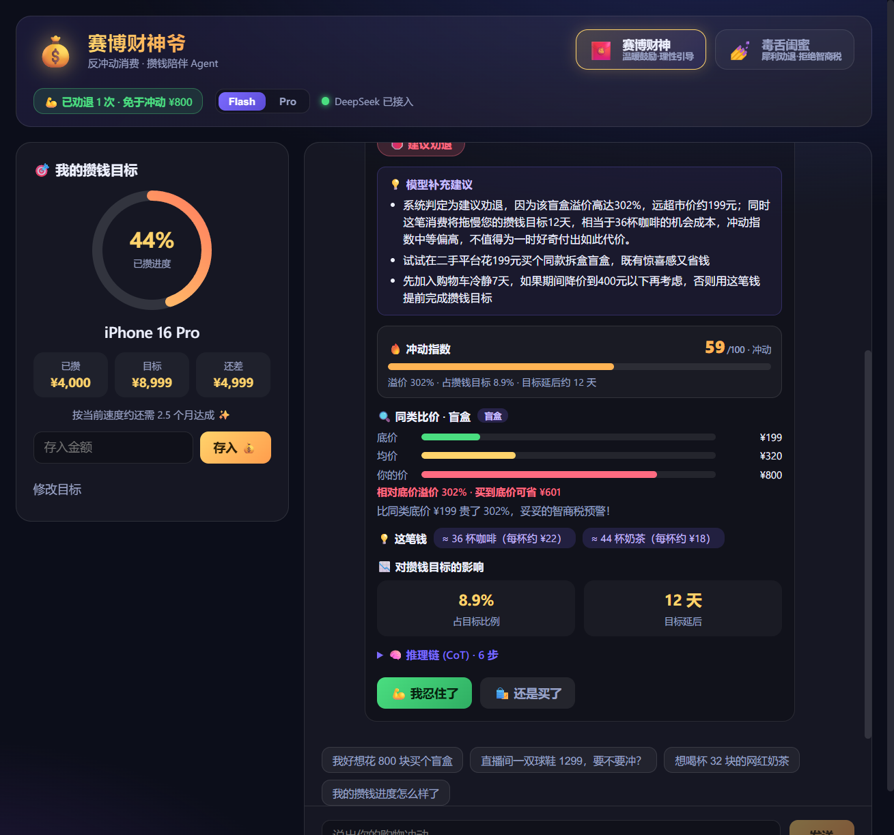

# 赛博财神爷 (cyber-caishen) 💰

> 反冲动消费与攒钱陪伴 Agent — 你说出购物冲动，它化身「赛博财神」或「毒舌闺蜜」，
> 通过**模拟同类比价 + 攒钱目标进度计算 + 可见的推理链（CoT）**，帮你判断这钱该不该花。

年轻人「该省省、该花花」，容易在直播间冲动消费，又渴望有目标地攒钱。
本项目是一个理财陪伴 Agent 的 PoC，面向蚂蚁 Agent 开发岗位作业，核心覆盖：**角色扮演（System Prompt）、意图识别、规则引擎 + LLM 润色、流式交互、产品闭环设计**。

## 效果预览

赛博财神模式：流式人格化回复（引用溢价率/占目标比例等数字说明裁决依据）→ 分析卡（冲动指数、比价柱状图、模型补充建议、CoT、忍住/购买）：



**建议演示路径**：左侧设攒钱目标 → 发送「我好想花 800 块买个盲盒」→ 等流式文字打完再看分析卡 → 点「我忍住了」→「把省下的钱存进目标」→ 切换毒舌闺蜜对比语气（各自保留聊天记录）。

## 核心特性

- **流式输出**：SSE 打字机呈现人格化回复；分析卡（劝退标签、冲动指数、比价图、CoT 等）在**文字流结束后**再展示，先听 Agent 说，再看数据。
- **模型可切换**：顶部在 `deepseek-v4-flash`（快·默认）与 `deepseek-v4-pro`（推理更强）间切换。
- **双人格角色扮演**：赛博财神 / 毒舌闺蜜，System Prompt 约束风格；**每个人格独立会话**，切换不丢记录、也不串味。
- **回复质量约束**：模型须用数字解释裁决依据，但**不输出**「裁决理由」「人格化收尾」等小标题；前后端均有清洗兜底。
- **模型补充建议**：流式结束后生成平替、等等党、冷静期等 2～3 条可执行建议（LLM 优先，失败走规则）。
- **规则优先 + LLM 兜底的意图识别**：品类词典 + 否定/纯询价/多金额语义；不确定时 fallback LLM 抽槽。
- **多轮上下文记忆**：支持「那买便宜点的呢」等追问，复用上一笔商品。
- **量化推理链（CoT）**：意图 → 比价 → 目标影响 → 机会成本 → 冲动指数 → 裁决（6 步）。
- **反冲动 → 攒钱闭环**：「我忍住了」记免于冲动统计；须再点「存进目标」才真正推进进度（区分少花 vs 已攒）。
- **优雅降级**：无 Key / 超时 / 异常时回退本地规则模板，演示始终可用。

## 技术栈

| 层 | 技术 |
|----|------|
| 后端 | Python 3.10+ · FastAPI · Uvicorn · SQLite · httpx · pytest |
| 前端 | React 18 · Vite · TypeScript |
| 模型 | DeepSeek（OpenAI 兼容），本地规则兜底 |

## 项目结构

```
cyber-caishen/
├── backend/
│   ├── app/
│   │   ├── agent.py        # CoT 编排、流式/非流式对话
│   │   ├── intent.py       # 意图识别
│   │   ├── price_db.py     # 模拟比价
│   │   ├── goal_service.py # 攒钱目标
│   │   ├── decision_service.py
│   │   ├── llm.py          # DeepSeek + 流式
│   │   ├── prompts.py      # 双人格 Prompt + 建议生成
│   │   └── ...
│   └── tests/              # 43+ 单元测试
├── frontend/src/
│   ├── components/         # ChatPanel / AnalysisCard / ...
│   └── utils/reply.ts      # 回复小标题清洗
└── docs/                   # 设计文档与截图
```

## 快速开始

### 1. 启动后端

```bash
cd backend
python -m venv .venv
# Windows: .\.venv\Scripts\activate
# macOS/Linux: source .venv/bin/activate
pip install -r requirements.txt
cp .env.example .env   # 填入 DEEPSEEK_API_KEY（可选）
uvicorn app.main:app --host 127.0.0.1 --port 8000
```

API 文档：http://127.0.0.1:8000/docs

### 2. 启动前端

```bash
cd frontend
npm install
npm run dev
```

打开 http://localhost:5173（`/api` 代理到 8000）。

### 3. 运行测试

```bash
cd backend
pytest tests/test_agent.py tests/test_intent.py tests/test_goal_service.py tests/test_price_db.py -q
```

## API 一览

| 方法 | 路径 | 说明 |
|------|------|------|
| GET  | `/api/health` | 健康检查 |
| GET/POST | `/api/goal` | 攒钱目标与进度 |
| POST | `/api/goal/deposit` | 存入金额 |
| POST | `/api/chat` | 非流式对话 |
| POST | `/api/chat/stream` | **SSE 流式**：`delta`（回复增量）→ `done`（含 `data` 结构化分析 + `suggestions`） |
| GET  | `/api/stats` | 劝退/购买/免于冲动统计 |
| POST | `/api/decision` | 记录忍住/购买 |

`/api/chat` 响应节选：

```json
{
  "reply": "你这盲盒溢价302%，占目标8.9%，还得多攒12天……",
  "verdict": "discourage",
  "suggestions": ["等等党：蹲到约 ¥199 再买", "设 24 小时冷静期"],
  "impulse": { "score": 59, "level": "冲动" },
  "cot_steps": [{ "label": "意图识别", "detail": "..." }],
  "llm_used": true
}
```

## 设计与裁决逻辑

规则引擎基于溢价率、占目标比例、延后天数做裁决，LLM 负责人格化表达（不推翻裁决）：

- 溢价率 ≥ 100% **或** 占目标 ≥ 10% **或** 延后 ≥ 30 天 → 劝退
- 溢价率 ≤ 30% **且** 占目标 ≤ 3% **且** 延后 ≤ 7 天 → 鼓励
- 其余 → 理性提醒

完整设计见 [`docs/superpowers/specs/`](docs/superpowers/specs/)。

## License

MIT
