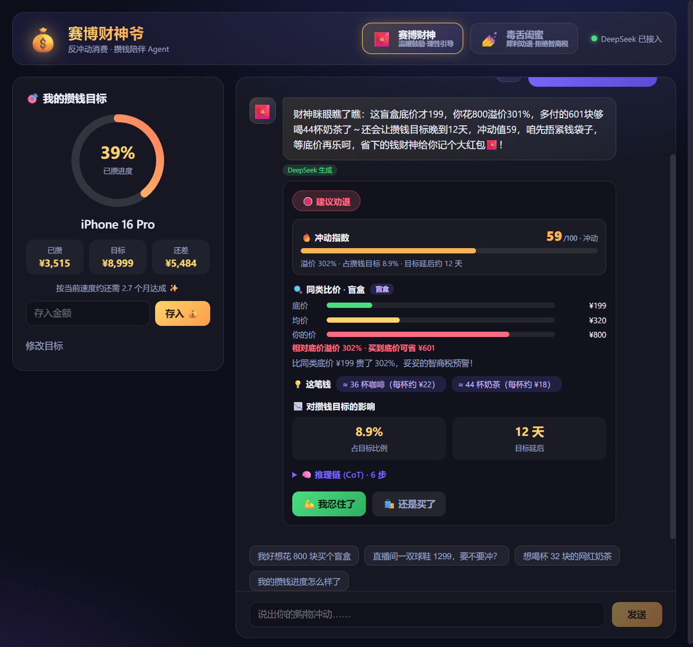
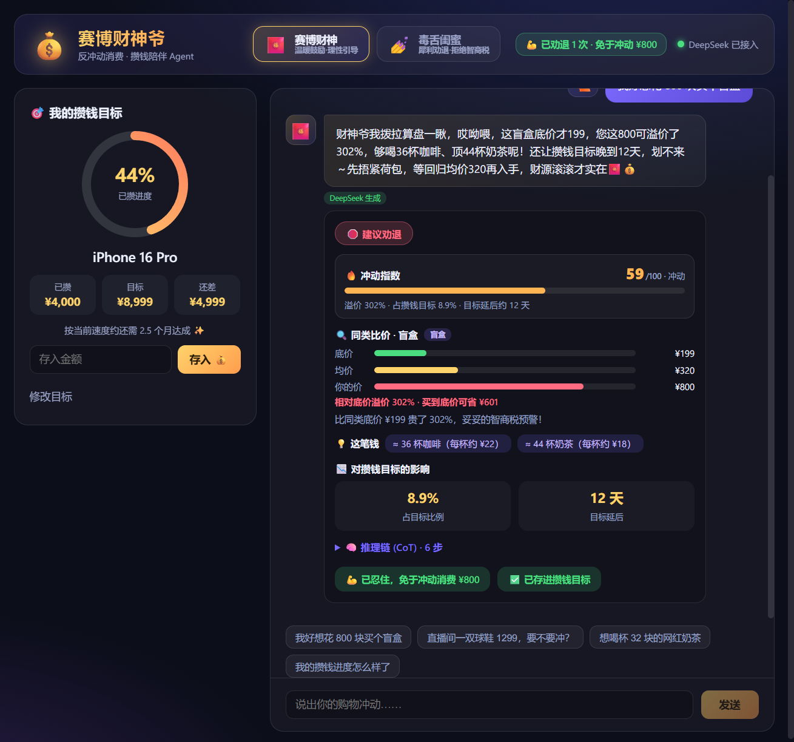
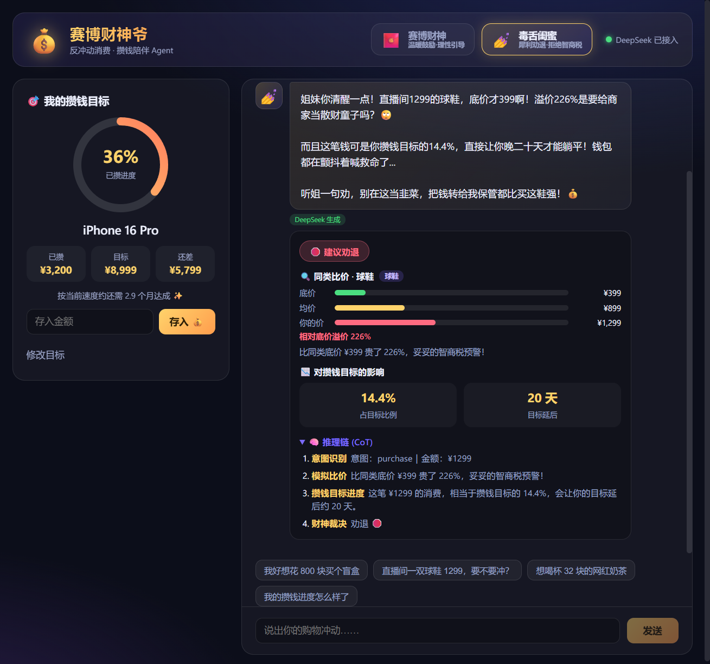

# 赛博财神爷 (cyber-caishen) 💰

> 反冲动消费与攒钱陪伴 Agent — 你说出购物冲动，它化身「赛博财神」或「毒舌闺蜜」，
> 通过**模拟同类比价 + 攒钱目标进度计算 + 可见的推理链（CoT）**，帮你判断这钱该不该花。

年轻人「该省省、该花花」，容易在直播间冲动消费，又渴望有目标地攒钱。
本项目是一个理财陪伴 Agent 的 PoC，核心实现了：**角色扮演（System Prompt 精准控制）、意图识别、数据计算与逻辑链推理（CoT）、产品交互设计**。

## 效果预览

消费分析（DeepSeek 实时生成 · 冲动指数 · 机会成本 · 6 步推理链）：



反冲动闭环：点「我忍住了」记为"免于冲动消费"，再点「把省下的钱存进目标」才真正推进攒钱进度（口径清晰，不混淆"少花"与"已攒"）：



毒舌闺蜜模式：



## 核心特性

- **双人格角色扮演**：赛博财神（温暖鼓励·理性引导）/ 毒舌闺蜜（犀利劝退·拒绝智商税），一键切换；System Prompt 含 few-shot 示例与输出约束，切换人格即重置会话，绝不串味。
- **稳健意图识别**：基于品类词典的物品识别（避免抓到价格数字/助词等垃圾），支持消费 / 设目标 / 查进度 / **克制(resist)** / 闲聊；处理**否定**（"不想买了"）、**纯询价**（"5000的相机贵吗"）、**多金额语义角色**（"月薪3000想买2万的包"取 2 万），全部纯规则、可离线、可单测。
- **多轮上下文记忆**：支持"那买便宜点的呢"这类追问，自动复用上一笔被讨论的商品。
- **量化推理链（CoT）**：意图 → 比价 → 目标影响 → **机会成本** → **冲动指数** → 裁决，6 步链路前端完整展示。
  - **冲动指数 0-100**：由溢价率(0.45) + 占目标比例(0.35) + 延后天数(0.20) 加权，分级"理智/犹豫/冲动/剁手警告"。
  - **机会成本**：把金额换算成"≈N 杯奶茶/咖啡"，更有体感。
- **反冲动 → 攒钱闭环**：对每条建议可选「我忍住了 💪」或「还是买了 🛍️」。忍住先记为"免于冲动消费"（累计"已劝退 N 次 · 免于冲动 ¥X"），再由用户**明确点"把省下的钱存进目标"**才真正推进进度——区分"避免支出"与"实际储蓄"两个口径，对应现实中真去转一笔账。把劝退变成看得见的正反馈。
- **模拟比价**：内置 14 类商品价格库，返回同类底价 / 均价 / 高价、溢价率与"买到底价可省多少"，可视化柱状图展示。
- **攒钱目标计算**：SQLite 持久化，进度环、消费占目标比例、目标延后天数、达成预估。
- **优雅降级**：默认调用 DeepSeek 生成人格化文案；无 Key / 超时 / 异常时自动回退本地规则模板，**保证演示永远可用**。

## 技术栈

| 层 | 技术 |
|----|------|
| 后端 | Python 3.10+ · FastAPI · Uvicorn · SQLite · httpx · pytest |
| 前端 | React 18 · Vite · TypeScript |
| 模型 | DeepSeek（OpenAI 兼容接口），本地规则兜底 |

## 项目结构

```
cyber-caishen/
├── backend/                # FastAPI 后端
│   ├── app/
│   │   ├── main.py         # 应用入口与路由
│   │   ├── intent.py       # 意图识别（抽取物品/金额/意图）
│   │   ├── price_db.py     # 模拟商品库与比价
│   │   ├── goal_service.py # 攒钱目标 CRUD 与进度/影响计算
│   │   ├── decision_service.py # 忍住/购买决策记录 + 省钱统计（反冲动闭环）
│   │   ├── agent.py        # Agent 核心：CoT 编排 + 冲动指数 + 裁决
│   │   ├── llm.py          # DeepSeek 客户端（失败回退）
│   │   ├── prompts.py      # 双人格 System Prompt + 兜底模板
│   │   ├── models.py       # Pydantic 模型
│   │   ├── db.py / config.py
│   │   └── ...
│   ├── tests/              # 21 个单元测试
│   ├── requirements.txt
│   └── .env.example
├── frontend/               # React + Vite + TS 前端
│   └── src/
│       ├── App.tsx
│       ├── components/     # ChatPanel / GoalPanel / AnalysisCard / RoleSwitch / ProgressRing ...
│       └── api/client.ts
└── docs/                   # 设计文档、实现计划、截图
```

## 快速开始

### 1. 启动后端

```bash
cd backend
python -m venv .venv
# Windows
.\.venv\Scripts\activate
# macOS / Linux
# source .venv/bin/activate

pip install -r requirements.txt

# 配置 DeepSeek（可选；不配置则自动使用本地兜底模式）
cp .env.example .env
# 编辑 .env，填入 DEEPSEEK_API_KEY，并按需设置 DEEPSEEK_MODEL（如 deepseek-v4-pro / deepseek-chat）

uvicorn app.main:app --host 127.0.0.1 --port 8000
```

后端启动后访问 http://127.0.0.1:8000/docs 可查看自动生成的 API 文档。

### 2. 启动前端

```bash
cd frontend
npm install
npm run dev
```

打开 http://localhost:5173 即可使用（Vite 已配置 `/api` 代理到后端 8000 端口）。

### 3. 运行测试

```bash
cd backend
pytest -q
```

## API 一览

| 方法 | 路径 | 说明 |
|------|------|------|
| GET  | `/api/health` | 健康检查，返回 LLM 是否接入 |
| GET  | `/api/goal` | 获取当前攒钱目标与进度 |
| POST | `/api/goal` | 创建 / 更新攒钱目标 |
| POST | `/api/goal/deposit` | 向目标存入金额（推进进度） |
| POST | `/api/chat` | 核心对话，返回人格化回复 + 结构化分析 + 冲动指数 + CoT（支持多轮 history/context） |
| GET  | `/api/stats` | 统计：劝退次数 / 购买次数 / 累计免于冲动消费金额 |
| POST | `/api/decision` | 记录"忍住/买了"（忍住不自动存入，由用户再明确存入） |

`/api/chat` 响应示例（节选）：

```json
{
  "reply": "姐妹听我一句👀 你这「盲盒」花 ¥800？同类底价才 ¥199，溢价 302%……",
  "role": "bestie",
  "intent": "purchase",
  "verdict": "discourage",
  "price": { "item": "盲盒", "lowest_price": 199, "avg_price": 320, "overprice_ratio": 3.02, "...": "..." },
  "impact": { "has_goal": true, "goal_impact_ratio": 0.1333, "delay_days": 12, "...": "..." },
  "cot_steps": [ { "label": "意图识别", "detail": "..." }, "..." ],
  "llm_used": true
}
```

## 设计与裁决逻辑

Agent 接收消费意图后，基于三个量化信号做规则裁决，再交由 LLM 进行人格化润色：

- **溢价率** `overprice_ratio`：用户报价相对同类底价的溢价
- **消费占目标比例** `goal_impact_ratio`：这笔钱占攒钱目标的百分比
- **延后天数** `delay_days`：按月攒钱速度折算，这笔消费会让目标延后的天数

裁决规则：

- 溢价率 ≥ 100% **或** 占目标 ≥ 10% **或** 延后 ≥ 30 天 → `劝退`
- 溢价率 ≤ 30% **且** 占目标 ≤ 3% **且** 延后 ≤ 7 天 → `鼓励`
- 其余 → `理性提醒`

更完整的设计见 [`docs/superpowers/specs/`](docs/superpowers/specs/)。

## License

MIT
